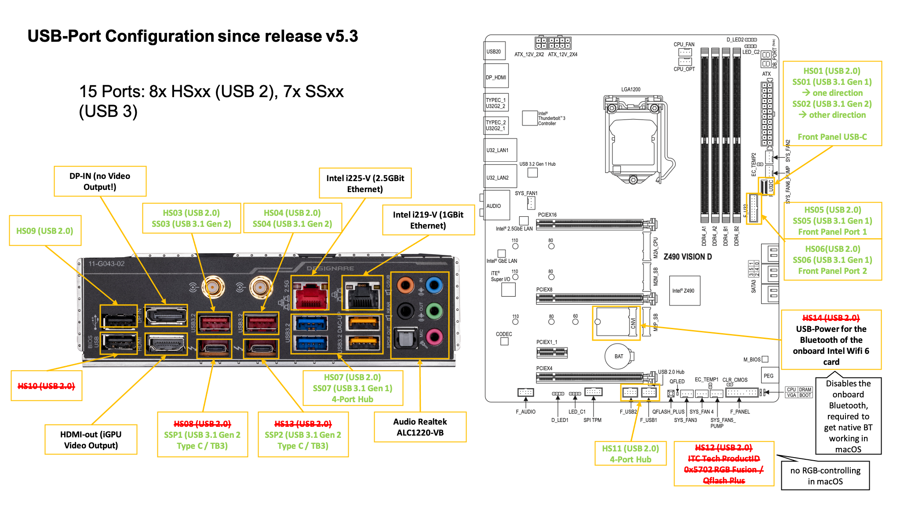
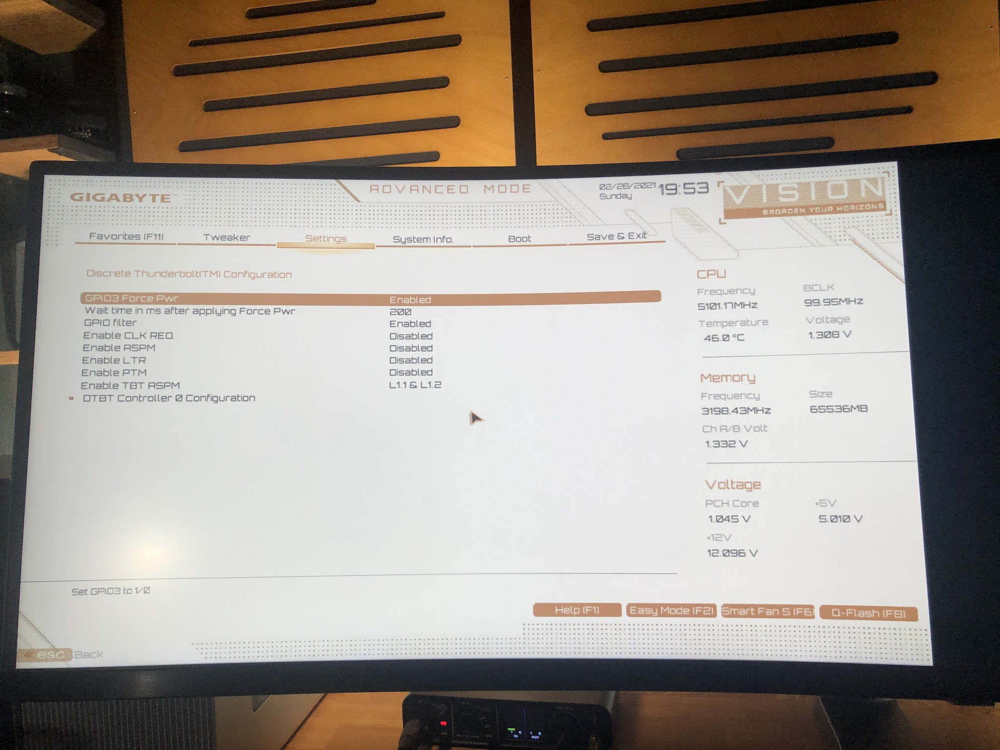

# Hackintosh-Intel-i9-10900k-Gigabyte-Z490-Vision-D


Hello folks,

I have successfully installed MacOS Catalina 10.15.4 on my i9-10900k running on a Gigabyte Z490 Vision D.

You can find my EFI folder in this repository.

## YouTube Video to this build ## 

I also made a video on how I got macOS running on my build and how I build this rig:
https://youtu.be/szOofRy7uBc

# Hardware
- Intel i9-10900k
- Gigabyte Z490 Vision D:
	- Audio: Realtek ALC1220-VB
	- 1Gbit Ethernet: Intel I219-V
	- 2.5Gbit Ethernet: Intel I225-V
	- Two USB-C/Thunderbolt 3 ports
- RAM: 64GB G.Skill Trident Z 3600Mhz CL18
- GPU: Formerly Radeon VII, 5700XT. Now RadeonPro W5500 (highly recommended) in an eGPU case (Razer Core) via TB3, but on my other configuration based on my AsRock Phantom Gaming TB3-ITX.  
- Wifi/BT: MQUPIN fenvi T919 Wireless Card with BCM94360CD

# Working
- [x] **Tested with macOS Catalina 10.15.6 and macOS Big Sur**
- [x] **Wifi and Bluetooth** (via BCM94360CD using a MQUPIN fenvi T919 Wireless Card). Replacing the onboard Intel WiFi-card doesn't work. See details below.
- [x] **Audio**: Realtek ALC1220-VB (AppleALC.kext, layout-id=7,FakeID.kext, FakePCIID_Intel_HDMI_Audio.kext)
- [x] **USB**, all ports.
- [x] **Thunderbolt 3** including Hot-plug
- [x] **1Gbit Ethernet (Intel I219-V)**
- [x] **2.5Gbit Ethernet (Intel I225-V)**
- [x] **With iMacPro1,1: Amazon Prime Video and Netflix in Safari. AppleTV.**
- [x] **With iMac20,2: SideCar and AppleTV, but no Amazon Prime Video and Netflix in Safari.** But Amazon Prime and Netflix works with other browsers like 
- [x] **Sleep/Wake**
- [x] **Shutdown**
- [x] **Restart**

# Not working so far
- Netflix and Prime in Safari with iMac20,x based configs.

# Details

## Installation steps

1. Create an MacOS Catalina 10.15.6 USB-Installer Stick. Do this on a real Mac.
	- Go into the app store and search for Catalina. Download it. It should download to your Macs application folder.
	- Plugin a plain vanilla USB-Stick with at least 16GB. My installation needed 8.24GB.
	- The following assumes your USB stick is called "MyVolume".
	- Check that "MyVolume" is partitioned with GUID. [Technical Note: GUID Format](TechnicalNotes.md/#technical-note-installation--guid-format)
	- Open the terminal and enter this command to create the installer (Replace "MyVolume" with your USB-sticks name. In this case Untitled: ```sudo /Applications/Install\ macOS\ Catalina.app/Contents/Resources/createinstallmedia --volume /Volumes/MyVolume```
	- Now there should be a progress bar in the terminal showing the creation process in %. Wait until it is complete.
	- At the end your USB-stick should be named "Install macOS Catalina".

2. Mount the EFI-partition of the "Install macOS Catalina" disk.
	- I use Hackintool for this.
	- Open Hackintool and go to the "Disks" menu. There you should see your disks.
	- Press the double-arrow in the 6th column on the USB disk to mount the EFI-partition of your installer disk.
	
	
3. Delete all folders and then copy my entire EFI folder to the root of the EFI-partition (make sure you copy the EFI Folder itself, not just the content of it)
4. Decide for yourself if you want to use: Rename the config of your choice to ```config.plist```. If you don't rename one and there is no ```config.plist``` it won't work!
* ```config_iMac20,2_iGPU_computing_only.plist```: iGPU for computing only. So you don't have display output to the onboard HDMI. Enable Internal Graphics in BIOS. AppleTV works. Amazon Prime/Netflix via Safari doesn't work, you need other browsers. Sidecar works.
* ```config_iMac20,2_iGPU_with display_output.plist```: iGPU setup for display output, so you will get display output to the onboard HDMI. Enable Internal Graphics in BIOS. AppleTV works. Amazon Prime/Netflix via Safari doesn't work, you need other browsers. Sidecar works.
* ```config_iMacPro1,1_requires AMD GPU.plist```: No iGPU. Disable Internal Graphics in BIOS. Requires discrete AMD GPU. AppleTV works. Amazon Prime/Netflix via Safari works. No Sidecar.

5. Go to EFI/OC and open the config.plist with a plist Editor (I use "PLIST Editor" from the app store but other alternatives are [XCode](https://developer.apple.com/support/xcode/) or [ProperTree](https://github.com/corpnewt/ProperTree))
6. Within the config.plist navigate to PlatformInfo/Generic and paste your serials for MLB, SystemSerialNumber and SystemUUID. You can generate them with the tool CloverConfigurator. [Technical Note: Serial Numbers](TechnicalNotes.md/#technical-note-installation--serial-numbers)
7. Make a backup of this altered EFI folder which includes your unique serial number changes.
8. Adjust your BIOS-Settings. See [My BIOS-settings](/bios-settings.md) for reference.
9. Reboot from the installation media and install macOS. The installation needs Internet. So either install a supported WiFi-card or plugin Ethernet.

If you get an error within the installation saying something like "this installation is damaged" you can try this workaround: 
 Delete Installinfo.plist on the installer disk:
  - Open the "Install macOS Catalina" Disk
  - Right Click on the package "Install macOS Catalina"
  - Click on "Package Contents"
  - Then navigate to Contents > SharedSupport
  - Delete the Installlnfo.plist


## Post Istall

Once you have installed MacOS Catalina onto your hackintosh's drive you should repeat the same steps above of installing the EFI folder onto it's EFI-partition:

  - (Don't have two EFI partitions mounted at the same time since it can confuse things)
  - Mount the EFI-partition of your hackintosh's drive (ie of the drive you installed Catalina onto)
  - Replace the entire contents of this EFI-partition with the your specialized entire EFI folder (which includes your own unique serial numbers)

Now your hackintosh can boot without the USB install stick.

Then following the other sections below you might want to investigate a GUI boot menu, a boot chime, and other post install niceties. (See [dortania post install cosmetics](https://dortania.github.io/OpenCore-Post-Install/cosmetic/gui.html#opencore-beauty-treatment))

# Using macOS and Windows with OC

You should change two settings in config.plist:
- **UpdateSMBIOSMode** to **Custom** 
- **CustomSMBIOSGuid** to **1**

## Fixing Sleep/Wake 

In this section I want to show you how I setup my system so it sleeps and wakes just fine, but I don't tell you that you need exactly these settings to have a proper configuration.

In addition, I set the following settings in Hackintool. You can edit them by clicking on the value, but it has a very small "clickable" area:


### Energy Saver Settings ###


### Bluetooth Settings ###


## USB

I don't use the Kext-based USB-configuration anymore. Instead, we use the USB-Port configuration via SSDT (SSDT-USB-Ports-Z490-VisionD.aml). 

The benefit of this is, that we don't need specific kexts for each SMBIOS (iMac20,2; iMacPro1,1 etc.) and it is the cleanest way of doing the USB-Port Mapping.

### My USB-port configuration ###



### HowTo change the USB-port configuration ###

In my SSDT you will see the comments for each port, some are enabled, some are disabled.

Per port you have two relevant methods: 
- GUPC (Gigabyte variant of the standard method _UPC: USB port Capabilities)
- GPLD (Gigabyte variant of the standard method _PLD: Physical Location of Device)

**GUPC describes the USB-port capabilities.**

E.g. GUPC (One, 0x03) means this port is enabled (one) and is a USB3-Type A (0x03) The first variable means enabled/disabled (one or 0xFF/zero or 0x00), the second variable describes the port itself.

- zero is the same as 0x00
- one is the same as 0xFF

**Port types:**
- 0x00 or zero: standard USB2 port (usually black)
- 0x03: USB3 Type A (usually blue, red or yellow)
- 0x09: Type-C with switch, where it doesn't matter which direction you plug the device in, it is always the same port.
- 0x0A: Type-C without switch, where there are used two ports, each for one direction.
- 0xFF: internal devices used for RGB, Audio, Bluetooth etc.

**GPLD-method describes the port location.** 

E.g. GPLD (One, 0x09) means this port is available on this board (one) and has the location HS09 (0x09). 

HS11 would be (0x0B). SS ports start with 1. E.g. SS01 is 0x11, SS10 is 0x1A.

If you don't know the Hex-names of the ports, you can use Hackintool, e.g. Decimal 9 is also Hex 9 but 10 is A:


If you want to disable ports for macOS-only, you should wrap them like this:
```
If (_OSI ("Darwin"))
{
  Return (GUPC (Zero, Zero))
}
Else
{
  Return (GUPC (0xFF, 0x09))
}
```
_OSI ("Darwin") means "If the operating system is macOS (Darwin Kernel) do this..."

This way other OS like Windows or Linux would use the Else-case where this port is enabled (0xFF) and has is a type-C with switch (0x09).

You also need to Delete the original ACPI-table for the USB-Port Mapping: SSDT-7-xh_cmsd4.aml 


## iGPU UHD630

If you want to use the iGPU to drive a display, use the iMac20,2-based config. There is no display output with the iMacPro1,1 because the iGPU is setup as computing unit only.

Note that the DisplayPort on the motherboard is no DP-out port. It is a DP-in port and it is only used to connect it to the DP-out of a graphics card to use the DisplayPort to Thunderbolt 3 feature, so you are able to have display output to the USBC/TB3 ports.

These are the device properties in the ```config_iMac20,2_iGPU_with_display output.plist``` to configure the iGPU as display output:
```
<key>PciRoot(0x0)/Pci(0x2,0x0)</key>
	<key>AAPL,ig-platform-id</key>
	<data>BwCbPg==</data>
	<key>device_type</key>
	<string>VGA compatible controller</string>
	<key>AAPL,slot-name</key>
	<string>Internal@0,2,0</string>
	<key>enable-hdmi20</key>
	<data>AQAAAA==</data>
	<key>framebuffer-con0-busid</key>
	<data>AgAAAA==</data>
	<key>framebuffer-con0-enable</key>
	<data>AQAAAA==</data>
	<key>framebuffer-con0-flags</key>
	<data>xwMAAA==</data>
	<key>framebuffer-con0-index</key>
	<data>AgAAAA==</data>
	<key>framebuffer-con0-pipe</key>
	<data>CgAAAA==</data>
	<key>framebuffer-con0-type</key>
	<data>AAgAAA==</data>
	<key>framebuffer-con1-busid</key>
	<data>BAAAAA==</data>
	<key>framebuffer-con1-enable</key>
	<data>AQAAAA==</data>
	<key>framebuffer-con1-flags</key>
	<data>xwMAAA==</data>
	<key>framebuffer-con1-index</key>
	<data>AwAAAA==</data>
	<key>framebuffer-con1-pipe</key>
	<data>CAAAAA==</data>
	<key>framebuffer-con1-type</key>
	<data>AAgAAA==</data>
	<key>framebuffer-con2-busid</key>
	<data>AQAAAA==</data>
	<key>framebuffer-con2-enable</key>
	<data>AQAAAA==</data>
	<key>framebuffer-con2-flags</key>
	<data>xwMAAA==</data>
	<key>framebuffer-con2-index</key>
	<data>AQAAAA==</data>
	<key>framebuffer-con2-pipe</key>
	<data>CQAAAA==</data>
	<key>framebuffer-con2-type</key>
	<data>AAgAAA==</data>
	<key>framebuffer-fbmem</key>
	<data>AACQAA==</data>
	<key>framebuffer-patch-enable</key>
	<data>AQAAAA==</data>
	<key>framebuffer-stolenmem</key>
	<data>AAAwAQ==</data>
	<key>framebuffer-unifiedmem</key>
	<data>AAAAgA==</data>
	<key>model</key>
	<string>Intel UHD Graphics 630</string>
	<key>hda-gfx</key>
	<string>onboard-1</string>
```

And these are the device properties used in the ```config_iMac20,2_iGPU_computing_only.plist``` to setup the iGPU as computing only:
```
<key>PciRoot(0x0)/Pci(0x2,0x0)</key>
	<key>AAPL,ig-platform-id</key>
	<data>AwDImw==</data>
	<key>AAPL,slot-name</key>
	<string>Internal@0,2,0</string>
	<key>device-id</key>
	<data>xZsAAA==</data>
	<key>device_type</key>
	<string>VGA compatible controller</string>
	<key>model</key>
	<string>Intel UHD Graphics 630 (Desktop)</string>
```


## Audio

I needed this to get Audio working:
- AppleALC.kext
- FakeID.kext
- FakePCIID_Intel_HDMI_Audio.kext
- layout-id=7
- ~~device-id=0xA170~~

The layout-id and the device-id is injected via the device properties.

The audio device has the PCI-Address PciRoot(0x0)/Pci(0x1F,0x3).
```
<key>PciRoot(0x0)/Pci(0x1F,0x3)</key>
	<dict>
	<key>hda-gfx</key>
	<string>onboard-1</string>
	<key>layout-id</key>
	<integer>7</integer>
	</dict>
```

## 1Gbit Ethernet (Intel I219-V)

Simply add the newest IntelMausiEthernet.kext (mine is v2.5.1d1).

## Wifi/Bluetooth
You need natively supported Wifi and Bluetooth to use Airdrop, Unlock with Apple Watch etc.

Replacing the onboard Intel-Wifi6 card doesn't work because the m.2 slot is a CNVi slot. Which means that it only supports CNVi-cards which are made by Intel. I have tried that already, trust me. You can either Insert a PCI-Express card like the MQUPIN fenvi T919 or buy a special adapter (google for "NGFF to m.2 B+M-Key adapter") to get an Apple-support m.2 card working in one of the m.2 Slots that are meant to be used for m.2 SSDs. Then you also need an adapter cable to get USB-power onto the m.2 adapter to get Bluetooth working.

I used the MQUPIN fenvi T919 Wireless/Bluetooth Card. It has the natively supported WiFi and Bluetooth chip BCM94360CD. 

No further kexts needed (no AirportBrcmFixup.kext, BrcmBluetoothInjector.kext, BrcmFirmwareData.kext, BrcmPatchRAM3.kext, BT4LEContiunityFixup.kext).

You also have to disable the onboard Intel Bluetooth. 

In your USB-configuration this is the port HS14. Either add "uia_exclude=HS14" to your Boot-arguments or generate a USBPorts.kext with Hackintool and remove HS14. 

If it is still not working, download Bluetooth Explorer from Apple Developer (it is inside "Additional_Tools_for_Xcode_11.4.dmg"). 

Then start Bluetooth Explorer App, select Tools/HCI Controller Selector. Then you should be able to see your Bluetooth adapter e.g. Apple BRCM. Select it and press "Activate". If it is marked as "Active" it is working.

## Thunderbolt 3 Support

To get fully working Mac-like Thunderbolt 3 support, you need
1) to set the BIOS settings properly
2) to flash your TB3 chip
3) SSDT-DTGP.aml and SSDT-TB3HP.aml (which you should generate on your own here: https://hackindrom.zapto.org)

Some devices might work without it, even hotplugging. Others won't. If you have issues with your TB3 device and don't want to flash your TB3 chip, you can try to disable SSDT-DTGP.aml and SSDT-TB3HP.aml. Then hotplug doesn't work, but the device might at least work when it is connected on boot.

Flashing a modified firmware will activate the Thunderbolt Bus. Without flashing the TB3-chip with a modified firmware, you might have issues with Hotplugging some TB3 devices. E.g. I couldn't get hotplug working on my TB3 eGPU case (Razer Core X). I could only get it working when it was connected while booting macOS.

Without flashing the TB3-chip on the motherboard your Thunderbolt section will always look like this: 


### To flash your TB3 chip, you need an EEPROM Flasher. The steps are:
1. Disconnect the PSU
2. Locate the Thunderbolt chip that you need to flash: [Location of the Thunderbolt chip on a Z490 Vision D](https://www.tonymacx86.com/threads/success-gigabyte-designare-z390-thunderbolt-3-i7-9700k-amd-rx-580.267551/post-2117837)
3. Connect the flasher (instructions below)
4. Make a backup of your current thunderbolt firmware that is on the chip.
5. Flash the modified firmware: [Modified Firmware](https://www.tonymacx86.com/threads/success-gigabyte-designare-z390-thunderbolt-3-i7-9700k-amd-rx-580.267551/post-2128769)
6. [Create your custom SSDT-TB3HP.aml](https://www.tonymacx86.com/threads/success-gigabyte-designare-z390-thunderbolt-3-i7-9700k-amd-rx-580.267551/page-2183#post-2129797)

### Detailed instructions of the flashing process
- [Everything you need to know is in here.](https://www.tonymacx86.com/threads/success-gigabyte-designare-z390-thunderbolt-3-i7-9700k-amd-rx-580.267551/post-2087524)

- [This set has everything you need for the flashing.](https://www.amazon.de/gp/product/B07SNTL5V6/ref=ppx_yo_dt_b_asin_title_o02_s00?ie=UTF8&psc=1)

- [Flashing procedure with this flasher.](https://www.tonymacx86.com/threads/success-gigabyte-designare-z390-thunderbolt-3-i7-9700k-amd-rx-580.267551/page-1523#post-2079848)

I have also used the following combo. Works as good as the first one:
- [Flasher.](https://www.amazon.de/gp/product/B07MPY65JN/ref=ppx_yo_dt_b_asin_title_o02_s00?ie=UTF8&psc=1)
- [Cables to connect the Flasher to the SOP8 clip](https://www.amazon.de/gp/product/B01EV70C78/ref=ppx_yo_dt_b_asin_title_o02_s00?ie=UTF8&psc=1)
- [The SOP8 clip which will sit on the TB3 chip](https://www.amazon.de/gp/product/B0713V5GGL/ref=crt_ewc_title_dp_1?ie=UTF8&psc=1&smid=AWLU8WJU8S0VS)
- [Flashing procedure with this flasher](https://www.tonymacx86.com/threads/success-gigabyte-designare-z390-thunderbolt-3-i7-9700k-amd-rx-580.267551/post-2161463)

### BIOS settings for Thunderbolt 3:




## Language

Default Keyboard Layout/Language setting was changed to EN-US in v1.5.

If you want to change this, just edit this setting in the config.plist:

```
- NVRAM
	- Add
		- 7C436110-AB2A-4BBB-A880-FE41995C9F82
			- prev-lang:kbd | String | en-US:0
```

Valid Keyboard Values see here: [AppleKeyboardLayouts.txt](https://github.com/acidanthera/OpenCorePkg/blob/master/Utilities/AppleKeyboardLayouts/AppleKeyboardLayouts.txt)

# Overclocking Experiences:

Don't use Overclocking and XMP with macOS. Longterm I only experienced instability even with only XMP enabled and even if it was running with XMP fine in Windows. I just had a client where try to get macOS running for 3h. In the end it was a Kernel panic caused by XMP. Just saying.

# Credits
Thanks for your support :) Your help was crucial for my build.
- the german hackintosh-community at hackintosh-forum.de: Especially dsm2, CMMChris, brumbaer, JimSalabim
- https://github.com/daliansky/XiaoXinPro-13-hackintosh: This repository inspired my first config and gave me the CPU-FakeID. Thank you for that :)
- [Dortania](https://github.com/dortania) for this great OpenCore Desktop Guide
- [headkaze](https://github.com/headkaze) for Hackintool and our productive conversations :)
- [Acidanthera](https://github.com/acidanthera) for too many things to mention each
- [RehabMan](https://github.com/RehabMan) for too many things to mention each
- [OpenCore project](https://github.com/OpenCorePkg) for this great bootloader

Best,
Chris 
aka SchmockLord
