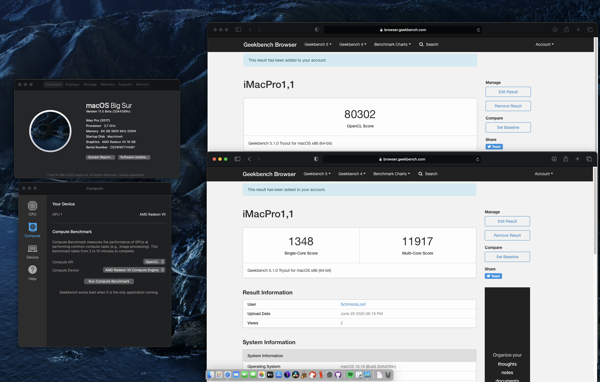
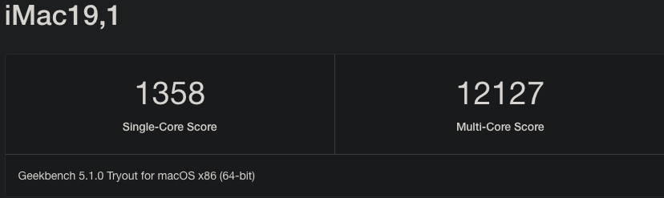
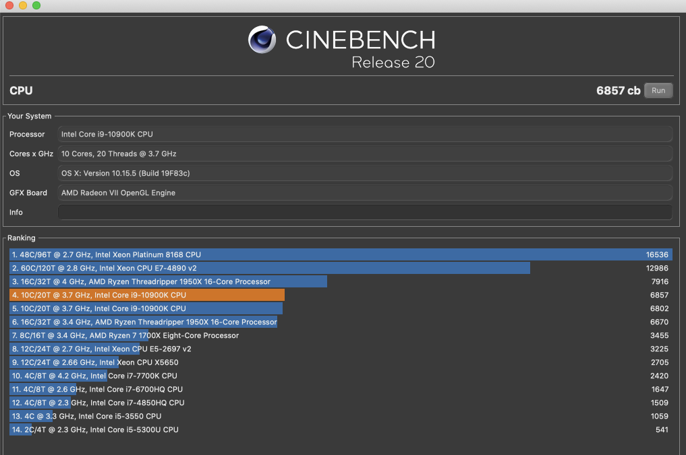
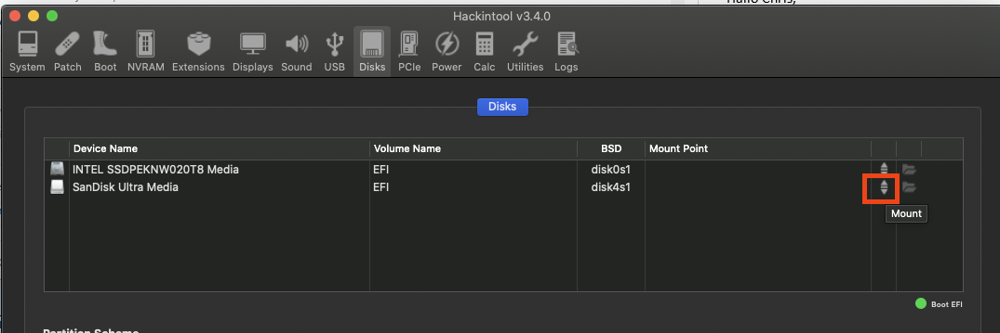
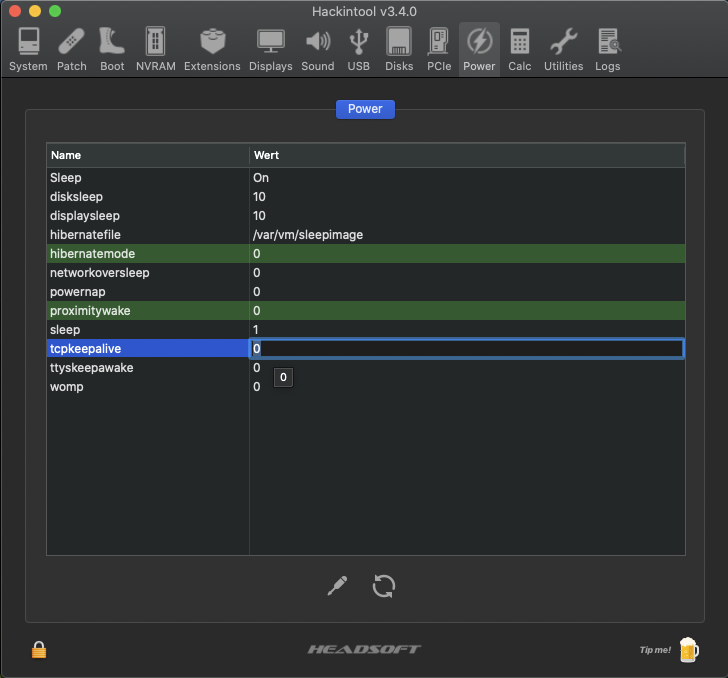
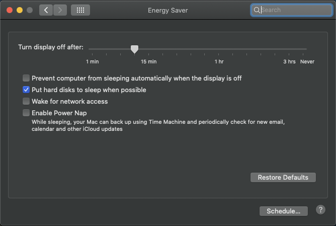
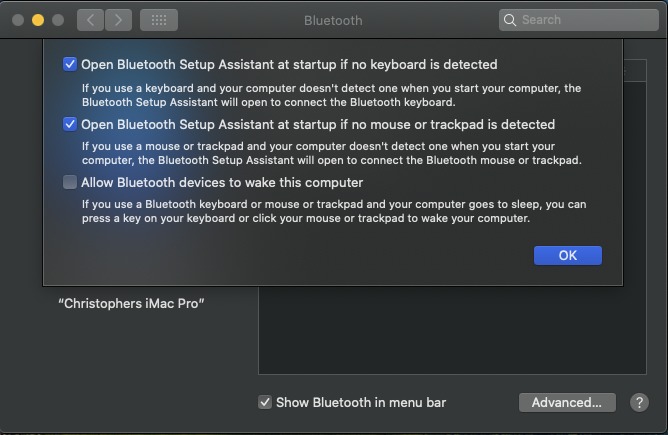
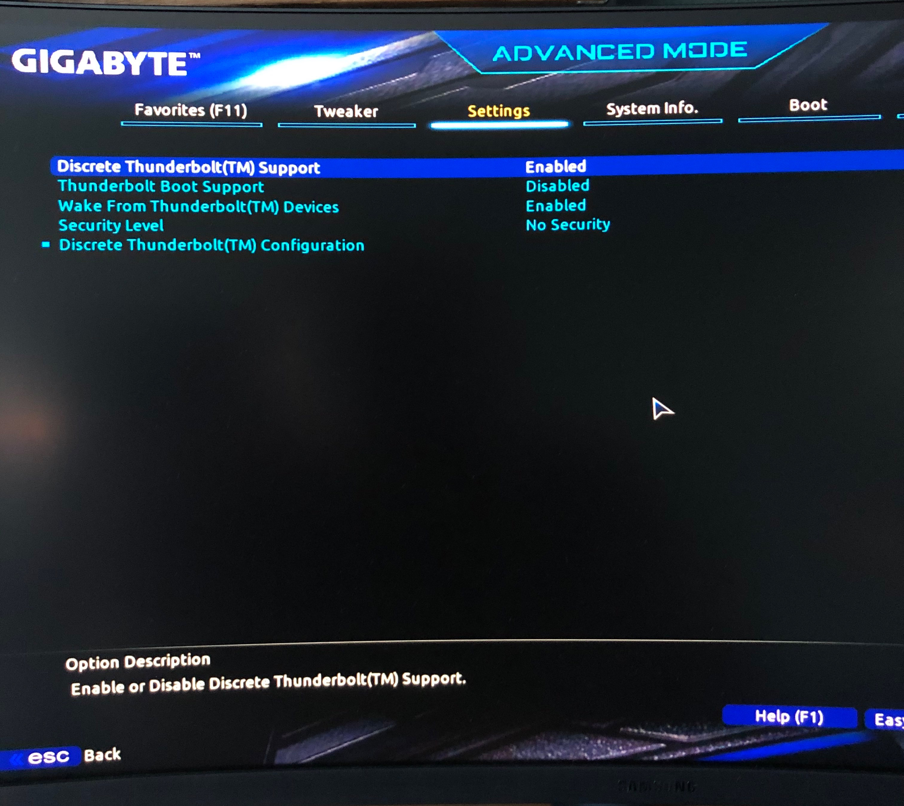
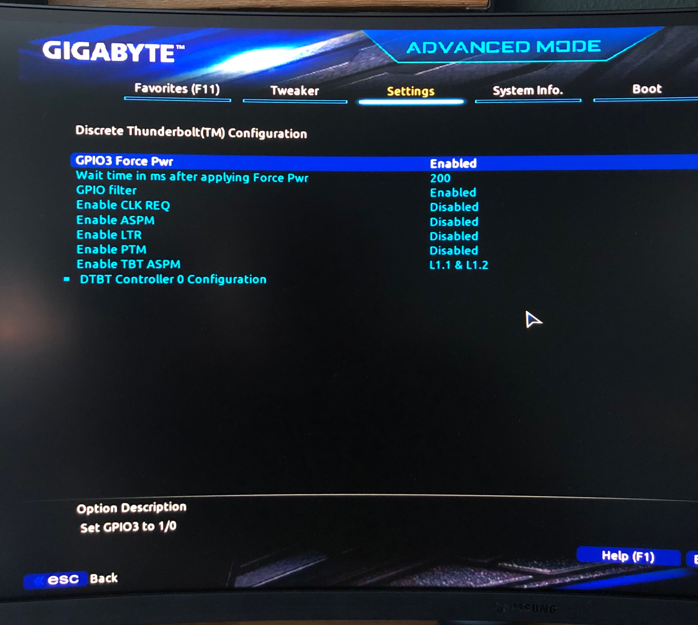

# Hackintosh-Intel-i9-10900k-Gigabyte-Z490-Vision-D



Hello folks,

I have successfully installed MacOS Catalina 10.15.4 on my i9-10900k running on a Gigabyte Z490 Vision D.

You can find my EFI folder in this repository.

**Current Bootloader: OpenCore 0.6.2 (5th Oct 2020)**

## YouTube Video to this build ## 

I also made a video on how I got macOS running on my build and how I build this rig:
https://youtu.be/szOofRy7uBc

# Hardware
- Intel i9-10900k
- Gigabyte Z490 Vision D:
	- Audio: Realtek ALC1220-VB
	- 1Gbit Ethernet: Intel I219-V
	- 2.5Gbit Ethernet: Intel I225-V
	- Two USB-C/Thunderbolt 3 ports
- RAM: 64GB G.Skill Trident Z 3600Mhz CL18
- GPU: ~~ASRock Phantom Gaming AMD Radeon VII~~ Saphire Pulse 5700 XT
- Wifi/BT: MQUPIN fenvi T919 Wireless Card with BCM94360CD

# Working
- [x] **Tested with macOS Catalina 10.15.6 and macOS Big Sur**
- [x] **Wifi and Bluetooth** (via BCM94360CD using a MQUPIN fenvi T919 Wireless Card). Replacing the onboard Intel WiFi-card doesn't work. See details below.
- [x] **Audio**: Realtek ALC1220-VB (AppleALC.kext, layout-id=7, device-id=0xA170, FakeID.kext, FakePCIID_Intel_HDMI_Audio.kext)
- [x] **USB**, all ports except the USB 2.0 on the rear panel labeled "BIOS". Disabled this due to the 15 port limit.
- [x] **Thunderbolt 3** including Hot-plug
- [x] **1Gbit Ethernet (Intel I219-V)**
- [x] **2.5Gbit Ethernet (Intel I225-V)**
- [x] **With iMacPro1,1: Amazon Prime Video and Netflix in Safari. AppleTV.**
- [x] **With iMac20,2: SideCar and AppleTV, but no Amazon Prime Video and Netflix in Safari.** But Amazon Prime and Netflix works with other browsers like 
- [x] **Sleep/Wake**
- [x] **Shutdown**
- [x] **Restart**

# Not working so far
- ~~[ ] **iGPU UHD630 HDMI-Output**: You cannot use the iGPU to drive your display. So far it is only working for GPU-acceleration like Intel QuickSync technology. Your help is appreciated here :).~~

# Benchmarks

OC: 5.2Ghz All-Core@1.31V, no Power Limit

### Geekbench
My Geekbench Profile: https://browser.geekbench.com/user/218488



### Cinebench

Cinebench R20 (with OC): 6857 points.

You can see my "old" Threadripper 1950x with OC to 4.0Ghz All-Core above(7916 points). The stock 1950x below (6670 points).



# Details

## Installation steps

1. Create an MacOS Catalina 10.15.6 USB-Installer Stick. Do this on a real Mac.
	- Go into the app store and search for Catalina. Download it. It should download to your Macs application folder.
	- Plugin a plain vanilla USB-Stick with at least 16GB. My installation needed 8.24GB.
	- The following assumes your USB stick is called "MyVolume".
	- Check that "MyVolume" is partitioned with GUID. [Technical Note: GUID Format](TechnicalNotes.md/#technical-note-installation--guid-format)
	- Open the terminal and enter this command to create the installer (Replace "MyVolume" with your USB-sticks name. In this case Untitled: ```sudo /Applications/Install\ macOS\ Catalina.app/Contents/Resources/createinstallmedia --volume /Volumes/MyVolume```
	- Now there should be a progress bar in the terminal showing the creation process in %. Wait until it is complete.
	- At the end your USB-stick should be named "Install macOS Catalina".

2. Mount the EFI-partition of the "Install macOS Catalina" disk.
	- I use Hackintool for this.
	- Open Hackintool and go to the "Disks" menu. There you should see your disks.
	- Press the double-arrow in the 6th column on the USB disk to mount the EFI-partition of your installer disk.
	
	
3. Delete all folders and then copy my entire EFI folder to the root of the EFI-partition (make sure you copy the EFI Folder itself, not just the content of it)
4. Decide for yourself if you want to use: Rename the config of your choice to ```config.plist```. If you don't rename one and there is no ```config.plist``` it won't work!
* ```config_iMac20,2_iGPU computing only_with 5700XT.plist```: iGPU for computing only. So you don't have display output to the onboard HDMI. Enable Internal Graphics in BIOS. AppleTV works. Amazon Prime/Netflix via Safari doesn't work, you need other browsers. Sidecar works.
* ```config_iMac20,2_iGPU with display output_with 5700XT.plist```: iGPU setup for display output, so you will get display output to the onboard HDMI. Enable Internal Graphics in BIOS. AppleTV works. Amazon Prime/Netflix via Safari doesn't work, you need other browsers. Sidecar works.
* ```config_iMacPro1,1_no iGPU_with 5700XT.plist```: No iGPU. Disable Internal Graphics in BIOS. AppleTV works. Amazon Prime/Netflix via Safari works. No Sidecar.
5. Go to EFI/OC and open the config.plist with a plist Editor (I use "PLIST Editor" from the app store but other alternatives are [XCode](https://developer.apple.com/support/xcode/) or [ProperTree](https://github.com/corpnewt/ProperTree))
6. Within the config.plist navigate to PlatformInfo/Generic and paste your serials for MLB, SystemSerialNumber and SystemUUID. You can generate them with the tool CloverConfigurator. [Technical Note: Serial Numbers](TechnicalNotes.md/#technical-note-installation--serial-numbers)
7. Make a backup of this altered EFI folder which includes your unique serial number changes.
8. Adjust your BIOS-Settings. See [My BIOS-settings](/bios-settings.md) for reference.
9. Reboot from the installation media and install macOS. The installation needs Internet. So either install a supported WiFi-card or plugin Ethernet.

If you get an error within the installation saying something like "this installation is damaged" you can try this workaround: 
 Delete Installinfo.plist on the installer disk:
  - Open the "Install macOS Catalina" Disk
  - Right Click on the package "Install macOS Catalina"
  - Click on "Package Contents"
  - Then navigate to Contents > SharedSupport
  - Delete the Installlnfo.plist


## Post Istall

Once you have installed MacOS Catalina onto your hackintosh's drive you should repeat the same steps above of installing the EFI folder onto it's EFI-partition:

  - (Don't have two EFI partitions mounted at the same time since it can confuse things)
  - Mount the EFI-partition of your hackintosh's drive (ie of the drive you installed Catalina onto)
  - Replace the entire contents of this EFI-partition with the your specialized entire EFI folder (which includes your own unique serial numbers)

Now your hackintosh can boot without the USB install stick.

Then following the other sections below you might want to investigate a GUI boot menu, a boot chime, and other post install niceties. (See [dortania post install cosmetics](https://dortania.github.io/OpenCore-Post-Install/cosmetic/gui.html#opencore-beauty-treatment))

## Fixing Sleep/Wake 

In this section I want to show you how I setup my system so it sleeps and wakes just fine, but I don't tell you that you need exactly these settings to have a proper configuration.

I also had to use ```SSDT-Disable-CNVW.aml``` to disable the CNVi feature of the m.2 slot, where the onboard Intel Wifi 6 sits, because the CNVi device was constantly waking up my PC.

In addition, I set the following settings in Hackintool. You can edit them by clicking on the value, but it has a very small "clickable" area:



### Energy Saver Settings ###



### Bluetooth Settings ###



## USB

I use USBInjectAll.kext and created my own SSDT-EC-USBX.aml and SSDT-UIAC.aml using Hackintool.

All ports are enabled, except for the USB 2.0 port that is labeled "BIOS" and intended to be used to flash the BIOS. I had to disable this to stay within the 15 port USB limit. And I don't need this port as much as the faster ones. BIOS flashing will work anyways, because this is done prior the Bootloader config.

[Alternative Port Configurations](USB-Port-Configuration.md)

## iGPU UHD630

If you want to use the iGPU to drive a display, use the iMac20,2-based config. There is no display output with the iMacPro1,1 because the iGPU is setup as computing unit only.

Note that the DisplayPort on the motherboard is no DP-out port. It is a DP-in port and it is only used to connect it to the DP-out of a graphics card to use the DisplayPort to Thunderbolt 3 feature, so you are able to have display output to the USBC/TB3 ports.

These are the device properties in the ```config_iMac20,2_iGPU with display output_with 5700XT.plist``` to configure the iGPU as display output:
```
	<key>PciRoot(0x0)/Pci(0x2,0x0)</key>
	<dict>
		<key>AAPL,ig-platform-id</key>
		<data>BwCbPg==</data>
		<key>device-id</key>
		<data>mz4AAA==</data>
		<key>framebuffer-con0-busid</key>
		<data>AgAAAA==</data>
		<key>framebuffer-con0-enable</key>
		<data>AQAAAA==</data>
		<key>framebuffer-con0-flags</key>
		<data>xwMAAA==</data>
		<key>framebuffer-con0-index</key>
		<data>AgAAAA==</data>
		<key>framebuffer-con0-pipe</key>
		<data>CgAAAA==</data>
		<key>framebuffer-con0-type</key>
		<data>AAgAAA==</data>
		<key>framebuffer-con1-busid</key>
		<data>BAAAAA==</data>
		<key>framebuffer-con1-enable</key>
		<data>AQAAAA==</data>
		<key>framebuffer-con1-flags</key>
		<data>xwMAAA==</data>
		<key>framebuffer-con1-index</key>
		<data>AwAAAA==</data>
		<key>framebuffer-con1-pipe</key>
		<data>CAAAAA==</data>
		<key>framebuffer-con1-type</key>
		<data>AAgAAA==</data>
		<key>framebuffer-con2-busid</key>
		<data>AQAAAA==</data>
		<key>framebuffer-con2-enable</key>
		<data>AQAAAA==</data>
		<key>framebuffer-con2-flags</key>
		<data>xwMAAA==</data>
		<key>framebuffer-con2-index</key>
		<data>AQAAAA==</data>
		<key>framebuffer-con2-pipe</key>
		<data>CQAAAA==</data>
		<key>framebuffer-con2-type</key>
		<data>AAQAAA==</data>
		<key>framebuffer-fbmem</key>
		<data>AACQAA==</data>
		<key>framebuffer-patch-enable</key>
		<data>AQAAAA==</data>
		<key>framebuffer-stolenmem</key>
		<data>AAAwAQ==</data>
	</dict>

```

And these are the device properties used in the ```config_iMac20,2_iGPU computing only_with 5700XT.plist``` to setup the iGPU as computing only:
```
	<key>PciRoot(0x0)/Pci(0x2,0x0)</key>
	<dict>
		<key>AAPL,ig-platform-id</key>
		<data>AwDImw==</data>
		<key>device-id</key>
		<data>mz4AAA==</data>
	</dict>
```


## Audio

I needed this to get Audio working:
- AppleALC.kext
- FakeID.kext
- FakePCIID_Intel_HDMI_Audio.kext
- layout-id=7 
- device-id=0xA170

The layout-id and the device-id is injected via the device properties.

The audio device has the PCI-Address PciRoot(0x0)/Pci(0x1F,0x3).
```
<key>DeviceProperties</key>
	<dict>
		<key>Add</key>
		<dict>
			<key>PciRoot(0x0)/Pci(0x1F,0x3)</key>
			<dict>
				<key>device-id</key>
				<data>cKEAAA==</data>
				<key>layout-id</key>
				<data>BwAAAA==</data>
			</dict>
		</dict>
	</dict>
```

## 1Gbit Ethernet (Intel I219-V)

Simply add the newest IntelMausiEthernet.kext (mine is v2.5.1d1).

## Wifi/Bluetooth
You need natively supported Wifi and Bluetooth to use Airdrop, Unlock with Apple Watch etc.

Replacing the onboard Intel-Wifi6 card doesn't work because the m.2 slot is a CNVi slot. Which means that it only supports CNVi-cards which are made by Intel. I have tried that already, trust me. You can either Insert a PCI-Express card like the MQUPIN fenvi T919 or buy a special adapter (google for "NGFF to m.2 B+M-Key adapter") to get an Apple-support m.2 card working in one of the m.2 Slots that are meant to be used for m.2 SSDs. Then you also need an adapter cable to get USB-power onto the m.2 adapter to get Bluetooth working.

I used the MQUPIN fenvi T919 Wireless/Bluetooth Card. It has the natively supported WiFi and Bluetooth chip BCM94360CD. 

No further kexts needed (no AirportBrcmFixup.kext, BrcmBluetoothInjector.kext, BrcmFirmwareData.kext, BrcmPatchRAM3.kext, BT4LEContiunityFixup.kext).

You also have to disable the onboard Intel Bluetooth. 

In your USB-configuration this is the port HS14. Either add "uia_exclude=HS14" to your Boot-arguments or generate a USBPorts.kext with Hackintool and remove HS14. 

If it is still not working, download Bluetooth Explorer from Apple Developer (it is inside "Additional_Tools_for_Xcode_11.4.dmg"). 

Then start Bluetooth Explorer App, select Tools/HCI Controller Selector. Then you should be able to see your Bluetooth adapter e.g. Apple BRCM. Select it and press "Activate". If it is marked as "Active" it is working.

## Thunderbolt 3 Support

In your BIOS set the following settings. You also need the SSDT-TB3.aml in EFI/OC/ACPI to enable Thunderbolt Hotplug support.





## Language

Default Keyboard Layout/Language setting was changed to EN-US in v1.5.

If you want to change this, just edit this setting in the config.plist:

```
- NVRAM
	- Add
		- 7C436110-AB2A-4BBB-A880-FE41995C9F82
			- prev-lang:kbd | String | en-US:0
```

Valid Keyboard Values see here: [AppleKeyboardLayouts.txt](https://github.com/acidanthera/OpenCorePkg/blob/master/Utilities/AppleKeyboardLayouts/AppleKeyboardLayouts.txt)

# Overclocking Experiences:

The highest Voltage I feel comfortable with for 24/7 is 1.35V.

I unlocked the Power Limit and tried 5.2 and 5.3 Ghz All-Core.

5.3 Ghz crashed in Benchmarks. 5.2Ghz worked. So far everything is working and no further crashing with 5.2Ghz.

5.2 Ghz All-Core is working with 1.31V and is stable so far.

Temps on idle: 35°C.

Temps while running Cinebench e.g. : 75-80°C.


Cooling solution: I have Thermalgrizzly Conductonaut applied, so fluid metal. And I have a custom watercooling loop with 2x 360mm and 1x 480mm radiator. Fans are spinning on minimum RPM until the temps reach 60°C. They reach 100% at 80°C.

# Credits
Thanks for your support :) Your help was crucial for my build.
- the german hackintosh-community at hackintosh-forum.de: Especially dsm2, CMMChris, brumbaer, JimSalabim
- https://github.com/daliansky/XiaoXinPro-13-hackintosh: This repository inspired my first config and gave me the CPU-FakeID. Thank you for that :)
- [Dortania](https://github.com/dortania) for this great OpenCore Desktop Guide
- [headkaze](https://github.com/headkaze) for Hackintool and our productive conversations :)
- [Acidanthera](https://github.com/acidanthera) for too many things to mention each
- [RehabMan](https://github.com/RehabMan) for too many things to mention each
- [OpenCore project](https://github.com/OpenCorePkg) for this great bootloader

Best,
Chris 
aka SchmockLord
