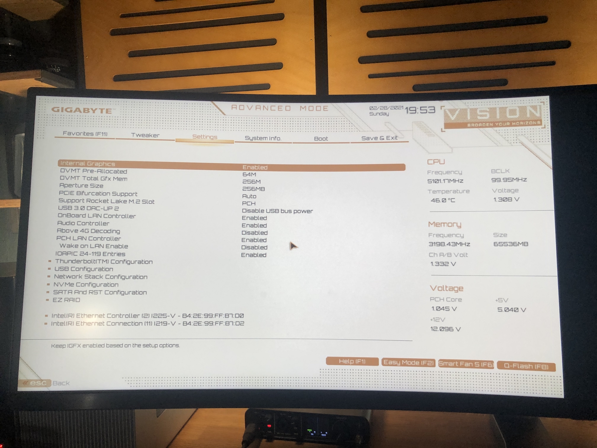
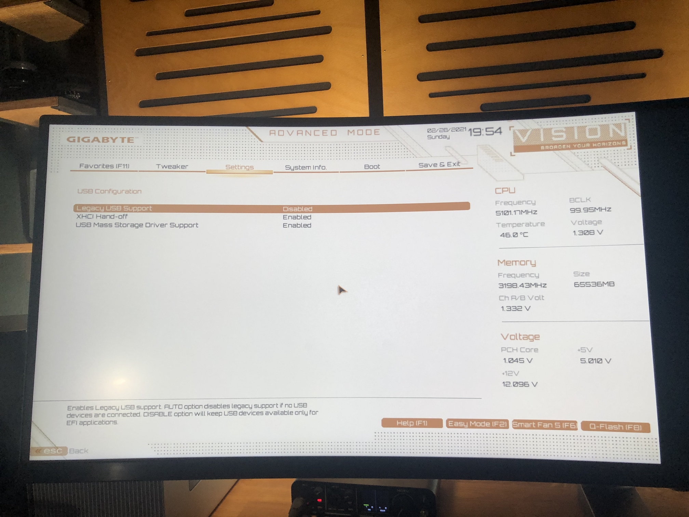
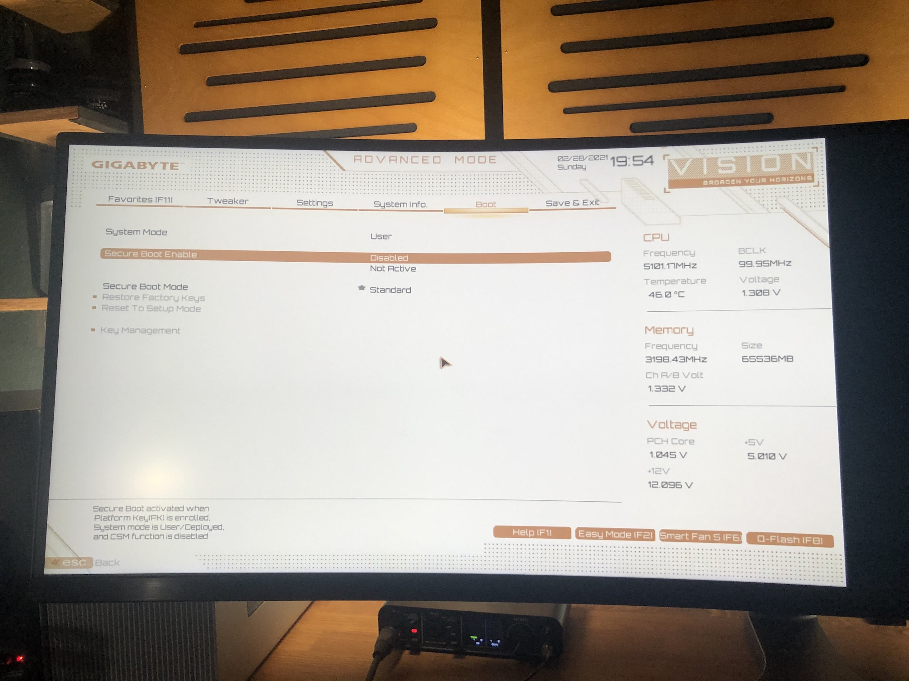

# My BIOS-settings

Some BIOS-settings are recommended for the Z490 platform in general, and some BIOS-settings depend on wether you use the iMac20,2 or the iMacPro1,1 config.

## Disable 
(reference: https://dortania.github.io/OpenCore-Install-Guide/config.plist/comet-lake.html#disable):
- Legacy USB Mode (very important. Always boot to OC in UEFI mode. So when you press F12 to select the boot devices, the OC one needs to start with UEFI. E.g. "UEFI: SanDisk")
- Fast Boot
- Secure Boot
- VT-d (can be enabled if you set DisableIoMapper to YES)
- CSM
- Intel SGX (Software Guard Extension)
- Intel Platform Trust
- CFG Lock (requires a newer BIOS version F5 (This must be off, if you can't find the option then enable both AppleCpuPmCfgLock and AppleXcpmCfgLock under Kernel -> Quirks. Your hack will not boot with CFG-Lock enabled)

## Enable 
(reference: https://dortania.github.io/OpenCore-Install-Guide/config.plist/comet-lake.html#enable):
- VT-x
- Above 4G decoding
- Hyper-Threading
- Execute Disable Bit
- EHCI/XHCI Hand-off
- OS type: Windows 10
- DVMT Pre-Allocated(iGPU Memory): 64MB
- SATA Mode: AHCI

## Thunderbolt
- GPIO Force Power: Enabled
- Security: No security

## iMac20,2-specific settings:
- Internal Graphics: Enabled
- DVMT Pre-Allocated: 64MB or 128MB (for QHD+/UHD)
- DVMT Total Gfx Mem: 256M

## iMacPro1,1-specific settings:
- Internal Graphics: Disabled

## My BIOS settings for BIOS f20b with iMac20,2:

I recommend to not just copy and paste my OC settings for the 10850k. Instead, try CPU Clock Ratio set to Auto and then apply a fixed voltage of 1.3V. This way your 10900k/10850k stay cooler than stock, where the Auto Voltage sometimes goes to 1.4V and higher.

Also, always try XMP-off and CPU @ stock settings before you post about stability issues here on github ;)

